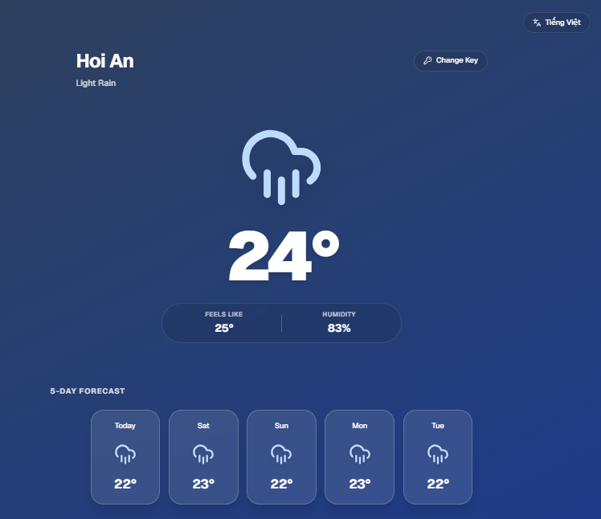

# Weather Vibe

Weather Vibe is a sleek, modern, and fully responsive weather application built with [Next.js](https://nextjs.org), [Tailwind CSS](https://tailwindcss.com/), and [Framer Motion](https://www.framer.com/motion/). It fetches real-time data from OpenWeatherMap, features dynamic glassmorphic UI elements that change based on current weather conditions, and natively supports English & Tiếng Việt (Vietnamese).

## Demo

**Live Site:** [https://vibe-weather-three.vercel.app/](https://vibe-weather-three.vercel.app/)



## Features

- **Dynamic Atmosphere:** The background gradient and icons automatically change to match the current weather (Clear, Rain, Clouds, etc.) and time of day (Day/Night).
- **Multi-language Support:** Easily toggle between English and Tiếng Việt (Vietnamese).
- **Responsive Layout:** A mobile-first design that looks great on any screen size.
- **Glassmorphism:** Premium UI aesthetics using backdrop blurring and translucent panels.
- **Smooth Animations:** Integrated with Framer Motion for elegant entry and state animations.
- **Local Storage:** Safely persists your API key locally in your browser.

## Getting Started

First, clone the repository and install the dependencies:

```bash
npm install
```

Then, run the development server:

```bash
npm run dev
```

Open [http://localhost:3000](http://localhost:3000) with your browser to see the application.

## OpenWeatherMap API Key Guide

To use this application, you will need a free API key from OpenWeatherMap.

1. **Visit** [openweathermap.org](https://openweathermap.org/) and click "Sign Up" to create a free account.
2. **Navigate** to your account profile in the top right and click on **"My API keys"**.
3. **Copy** the generated "Default" key, or generate a new one specifically named `weather-vibe`.
4. **Important Note:** Free API keys from OpenWeatherMap can sometimes take anywhere from 30 to 120 minutes to fully activate. If you run the app and immediately see an "Invalid Key" error after pasting your new key, please wait a while and try again later.

---

This project was bootstrapped with [`create-next-app`](https://nextjs.org/docs/app/api-reference/cli/create-next-app) and leverages [`next/font`](https://nextjs.org/docs/app/building-your-application/optimizing/fonts) to automatically optimize and load Geist fonts.
